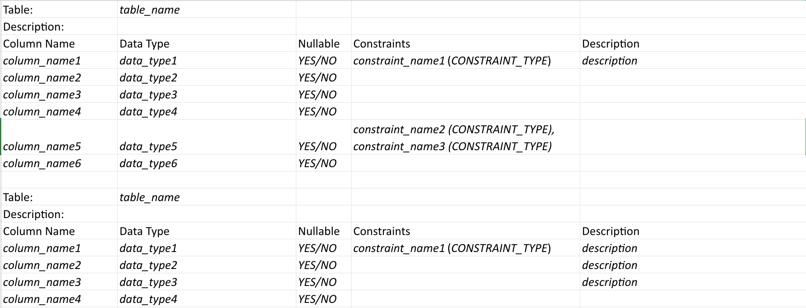
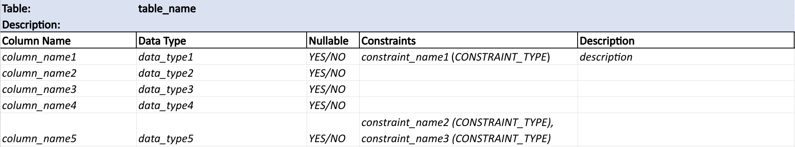

# data-dictionary
Generates a .csv data dictionary of a Postgres database instance in the following format:

* An empty row will be added between each table.

* The `Constraints` column will be populated if constraints exist for the corresponding attribute in the database.

* The `Description` fields are left empty and are meant to be populated manually.

## Dependencies
Tested using Python 3.12.4 and requires the following module:

  * psycopg2

## Usage

    usage: ./data_dictionary.py [-h] [--h HOST] [--p PORT] [--u USER]
                                [--pw PASSWORD] [--db DBNAME] [--t TITLE]
    
    options:
        --help     show this help message and exit
        --h HOST       Postgres host (default: localhost)
        --p PORT       Postgres port (default: 5432)
        --u USER       Postgres user (default: postgres)
        --pw PASSWORD  Postgres password (default: "")
        --db DBNAME    Postgres database name (default: postgres)
        --t TITLE      Report title (default: data_dictionary)

## Further formatting
To format each table in the .csv file in Excel in this manner:

You can use the following conditional formatting fomulas:
* For the first row containing `Table:` and `table_name`:
  * `=OR($C1="Column Name", $C2="Data Type", $C3="Nullable", $C4="Constraints", $C5="Description")` applied to columns `A:E`

* For the second row containing `Description`:
  * `=OR($B1="Column Name", $B2="Data Type", $B3="Nullable", $B4="Constraints", $B5="Description")` applied to columns `A:E`

* For the third row containing the column headers of the table:
  * `=OR($A1="Column Name")` applied to columns `A:E`
